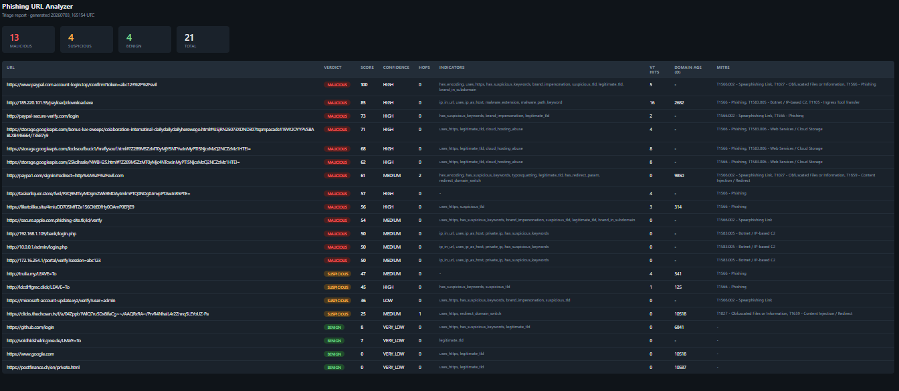

# Phishing URL Analyzer


A detection and triage tool that analyzes URLs for phishing indicators,
enriches them with threat intelligence and maps findings to MITRE ATT&CK
techniques. Built as part of a detection engineering portfolio -
demonstrating triage workflows in code. Phishing URLs are the entry point
of most card fraud, which is where I spent two years working 24/7 fraud
detection at a Swiss payment services provider.



---

## What it does

Runs a five-stage pipeline for every URL submitted:

1. **Redirect chain following** - tracks hops, detects mid-chain domain switches
2. **Feature extraction** - 25+ signals: brand impersonation, typosquatting,
   homoglyphs, entropy, cloud hosting abuse, malware extensions, private IPs, and more
3. **Threat intelligence enrichment** - VirusTotal v3, URLScan.io, WHOIS domain age
   (all optional - degrades gracefully without API keys)
4. **Risk scoring** - weighted, rule-based 0–100 score with
   `BENIGN` / `SUSPICIOUS` / `MALICIOUS` verdict and confidence level
5. **MITRE ATT&CK mapping** - tags each result with relevant technique IDs

---

## Installation

```bash
git clone https://github.com/Pingu314/phishing_url_analyzer.git
cd phishing_url_analyzer
pip install -e ".[dev]"
cp config/config.json.example config/config.json
# Edit config/config.json and add your API keys (optional)
```

---

## Usage

```bash
# Single URL
phishing-analyze -u "http://paypa1.com/verify"
python -m src.main -u "http://paypa1.com/verify"   # equivalent

# Batch file
phishing-analyze -f data/sample_urls/urls.txt

# With all options
phishing-analyze -u "http://suspicious-site.com/login" --verbose --export --csv --html
```

| Flag | Description |
|------|-------------|
| `-u URL` | Single URL to analyze |
| `-f FILE` | File with one URL per line (auto-exports JSON) |
| `-v` / `--verbose` | Show full feature dict and intel output |
| `--export` | Export JSON report to `reports/` |
| `--csv` | Export CSV summary to `reports/` |
| `--html` | Export styled HTML triage report to `reports/` |
| `--config PATH` | Path to config file (default: `config/config.json`) |

---

## How scoring works

Each signal adds a fixed number of points. Score is capped at 100.

| Signal | Weight | MITRE |
|--------|--------|-------|
| VirusTotal malicious engines | 20 × engines (max 40) | T1566 |
| URLScan malicious verdict | 20 | T1566 |
| Brand impersonation | 18 | T1566.002 |
| Typosquatting (homoglyph / edit-distance) | 18 | T1566.002 |
| Cloud hosting abuse | 18 | T1583.006 |
| Private IP as host | 20 | T1583.005 |
| Brand in subdomain | 15 | T1566.002 |
| Malware extension in path | 15 | T1105 |
| Uses IP as host | 15 | T1583.005 |
| Redirect domain switch | 12 | T1659 |
| Suspicious TLD | 10 | - |
| New domain (< 30 days) | 8 | - |
| Suspicious keywords in URL | 8 | T1566.002 |
| Malware path keyword | 8 | T1105 |
| At-symbol in URL | 8 | - |
| No HTTPS | 7 | - |
| High path entropy | 6 | T1027 |
| Hex encoding | 6 | T1027 |
| Redirect parameter | 6 | T1659 |
| High domain entropy | 5 | - |
| Double slash in path | 5 | - |
| Long URL (> 75 chars) | 4 | - |
| Many redirect hops (> 1) | 4 | T1027 |
| Many hyphens (> 3) | 3 | - |
| Deep path (> 4 levels) | 3 | - |
| Many subdomains (> 2) | 3 | - |
| Non-standard port | 3 | - |

**Verdict thresholds:** `BENIGN` 0–20 · `SUSPICIOUS` 21–49 · `MALICIOUS` 50–100

**Confidence levels:**

| Level | Condition |
|-------|-----------|
| HIGH | TI confirms malicious AND ≥3 signals fired |
| MEDIUM | ≥4 signals fired OR TI present |
| LOW | 2–3 signals fired |
| VERY_LOW | 0–1 signals fired |

---

## Architecture

```
URL input
    │
    ▼
RedirectFollower          ──►  redirect_chain  (hops, domain switches, final URL)
    │
    ▼
URLFeatureExtractor       ──►  features dict   (25+ signals, original URL)
    │
    ▼
ThreatIntelEnricher       ──►  intel dict      (VirusTotal · URLScan.io · WHOIS)
    │
    ▼
RiskScorer                ──►  score, verdict, confidence, breakdown
    │
    ▼
map_to_mitre              ──►  [T1566.002, T1027, T1583.006, ...]
    │
    ▼
ReportGenerator           ──►  reports/report_YYYYMMDD_HHMMSS.json / .csv / .html```

---

## Project structure

```
phishing_url_analyzer/
├── src/
│   ├── main.py                     # CLI entrypoint (phishing-analyze)
│   ├── url_extractor.py            # Feature extraction (25+ signals)
│   ├── risk_scorer.py              # Weighted scoring + confidence
│   ├── threat_intel.py             # VirusTotal · URLScan.io · WHOIS
│   ├── redirect_follower.py        # Redirect chain follower
│   ├── report_generator.py         # JSON + CSV + HTML export
│   └── mitre_mapper.py             # MITRE ATT&CK tag mapper
├── config/
│   ├── settings.py                 # All weights, lists, thresholds
│   └── config.json.example         # API key template
├── tests/
│   ├── conftest.py                 # Shared pytest fixtures
│   ├── test_url_extractor.py       # URLFeatureExtractor (33 tests)
│   ├── test_risk_scorer.py         # RiskScorer (18 tests)
│   ├── test_redirect_follower.py   # RedirectFollower (11 tests)
│   ├── test_mitre_mapper.py        # map_to_mitre (13 tests)
│   ├── test_threat_intel.py        # ThreatIntelEnricher (17 tests)
│   ├── test_report_generator.py    # ReportGenerator (9 tests)
│   └── test_main.py                # load_config, analyze_url, main (24 tests)
├── data/
│   └── sample_urls/
│       └── urls.txt                # Sample URLs for batch testing
└── reports/                        # Generated reports (gitignored)
```

---

## Running tests

```bash
# Install test dependencies
pip install -e ".[dev]"

# Run tests
pytest tests/ -v

# Run with coverage report
pytest tests/ --cov=src --cov-report=term-missing

# Install lint dependencies (separate from dev)
pip install -e ".[lint]"
flake8 src/ tests/ config/
```

---

## Configuration

Copy `config/config.json.example` to `config/config.json` and add your API keys.
All keys are optional - the tool degrades gracefully without them.

```json
{
  "virustotal_api_key": "your_key_here",
  "urlscan_api_key": "your_key_here"
}
```

All detection weights, thresholds, keyword lists, and TLDs are in
`config/settings.py`. Changes take effect on the next run - no reinstall required.

### API key notes

URLScan.io scans are submitted with `visibility: private` - result links are
only accessible to the submitting account. Do not analyze sensitive or
internal URLs with API keys configured.

VirusTotal works on a free tier (1000 lookups/day). URLs not yet in the
database are submitted for future analysis.

---

## Future Improvements

- AbuseIPDB integration for IP reputation scoring
- Webhook output for SIEM integration
- Persistent cache (Redis) for VT/URLScan results
- WHOIS registrar reputation scoring
- P4 orchestrator integration - unified triage across P1, P2, P3

---

## Limitations

- Heuristic and rule-based - false positives and false negatives are expected
- In-memory only - no persistence between runs
- WHOIS data quality varies by registrar

---

## Disclaimer

This tool is built for educational and portfolio purposes as part of a
security learning path (CompTIA Security+, TryHackMe SOC Level 1).

Do not use this tool to analyze URLs you do not have permission to test.
Results are heuristic - this is not a replacement for production security tooling.

---

## Portfolio context

| # | Project | Description |
|---|---------|-------------|
| P1 | [soc_threat_analyzer](https://github.com/Pingu314/soc_threat_analyzer) | Log-based threat detection - brute force, password spraying, impossible travel |
| P2 | **phishing_url_analyzer** | This project - phishing URL analysis pipeline |
| P3 | [email_header_analyzer](https://github.com/Pingu314/email_header_analyzer) | Email header analysis - SPF/DKIM/DMARC, routing, MIME evasion |